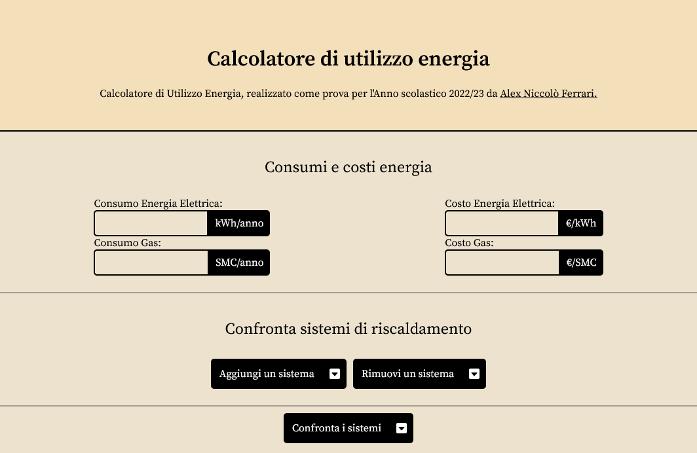
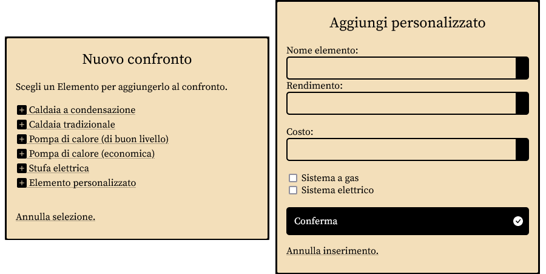
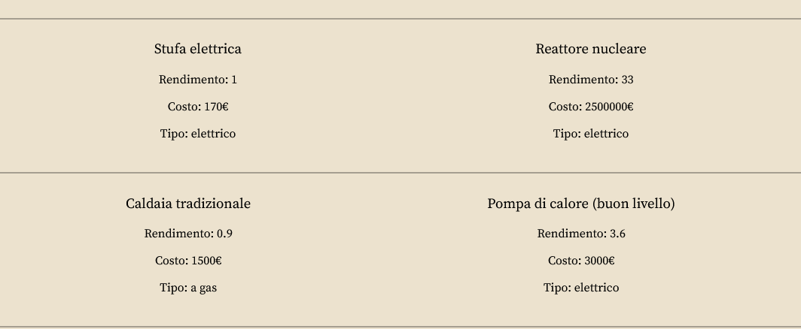
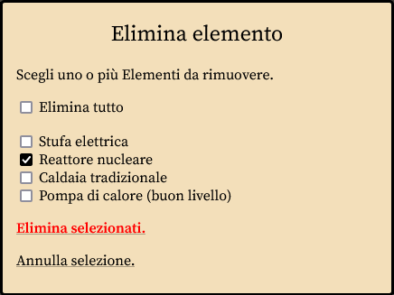

# Analisi Funzionale

Il Software si presenta come un sito web, che permette di inserire i dati necessari per il calcolo attraverso degli input posizionati nella prima sezione. E' possibile inserire diversi sistemi di riscaldamento nella seconda sezione del sito. Una volta inseriti i dati, si può procedere al calcolo, che viene eseguito in automatico e di cui il risultato viene mostrato nella terza sezione del sito.

*Interfaccia del software*

## Inserimento degli elementi
Gli elementi da confrontare vengono inseriti tramite un form, si possono selezionare degli elementi predefiniti o inserire nuovi elementi. I dati inseriti sono poi visibili nella pagina.

## Lista degli elementi

La lista degli elementi inseriti viene mostrata nella pagina, mostra tutti gli elementi inseriti e i loro dati.

## Rimozione elementi

Gli elementi possono essere rimossi dalla lista tramite il pulsante "Rimuovi un sistema". Possono essere selezionati elementi individuali o tutti gli elementi.

